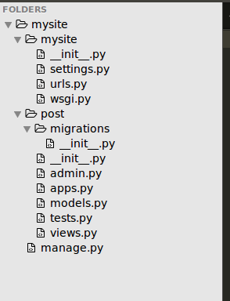
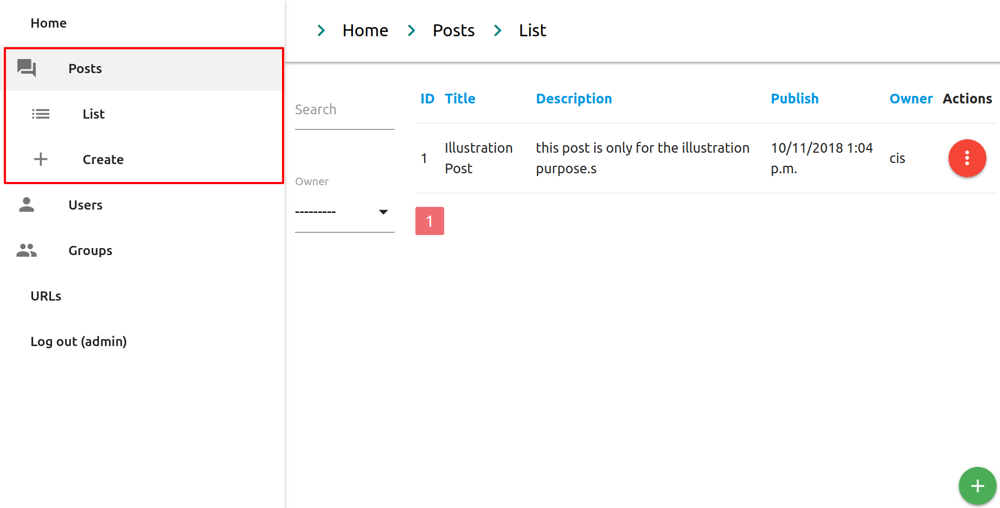
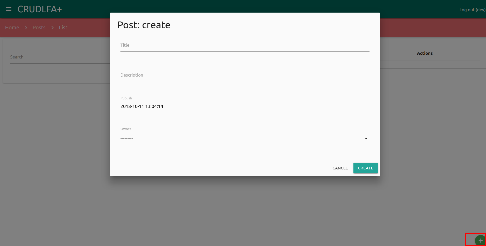
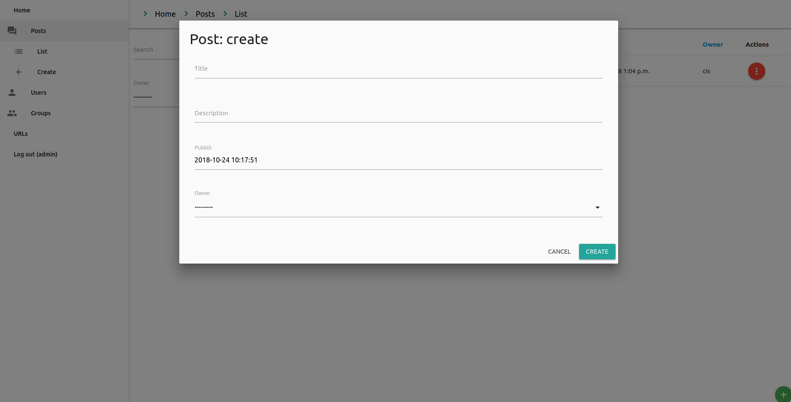
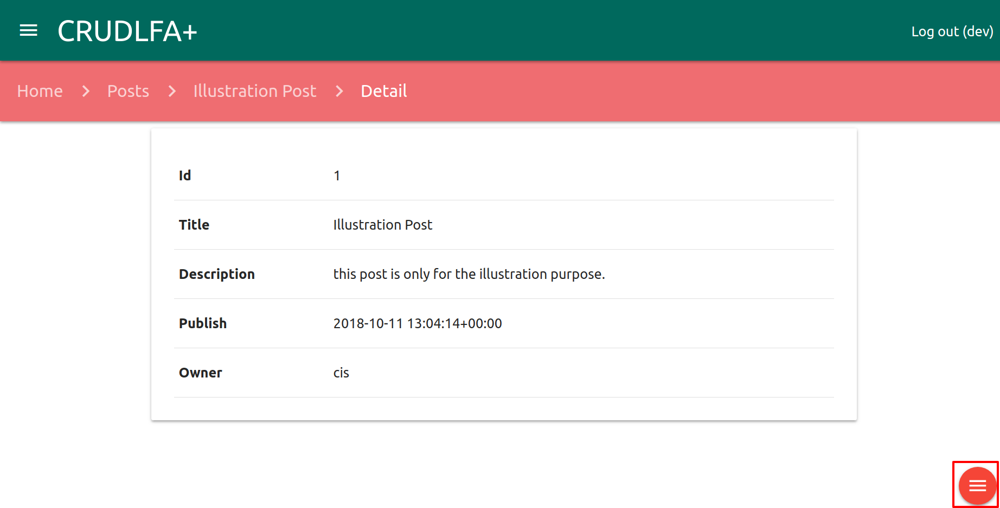
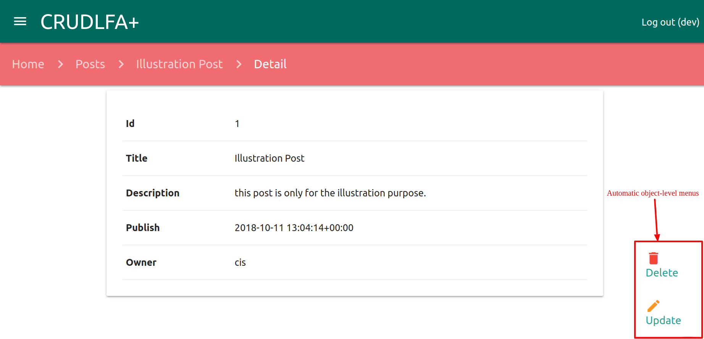
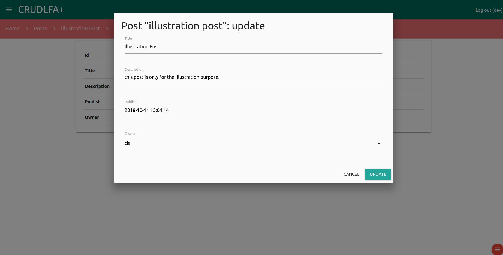
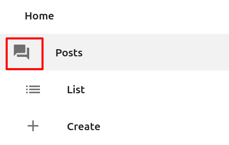

---

@title[CRUDLFA]

## @color[#DC143C](CRUDLFA+)

CRUDLFA+ stands for Create Read Update Delete List Form Autocomplete and more.

---

### @css[crudlfa-headline](prerequisite)

- pip |
	- pip is a package manager for Python packages, or modules if you like. |
- Virtualenv |
	- virtualenv is a tool to create isolated Python environments. |
		  
---
### @color[#DC143C](Django)
  Django is a free and open source web application framework written in Python. A framework is nothing more than a collection of modules that make development easier.

---

### @color[#DC143C](Installation of Django)
     					pip install django

---
### @color[#DC143C](Create Django Project)
- startproject |
	  django-admin startproject mysite
- Directory structure |

Note:
- This will create a mysite directory in your current directory, and the structure would like this.

---
### @color[#DC143C](Create post application)
- startapp |
	   django-admin startapp post
- Application Structure |

Note:
- This will create a post application in inside mysite directory.

---
### @color[#DC143C](default View)
- Run Server |
	  python manage.py runserver
- You can access your application using the following URL. |
	  http://127.0.0.1:8000

Note:
- This is the default view of the django application.
- Now we will learn CRUD operation using CRUDLFAP.

---
### @css[crudlfa-headline](Integration of CRUDLFA+)

- You can install CRUDLFA+ by the following ways. |
	- Installing from pip |
		  pip install crudlfap
	- If you are not in a virtualenv, the above will fail if not executed as root, in this case use |
		  pip install --user crudlfap

---?code=assets/sample/settings.py&lang=python&title=@css[crudlfa-headline](Integration of CRUDLFA+)
@[14-15](import @color[#DC143C](CRUDLFAP_APPS) and @color[#DC143C](CRUDLFAP_TEMPLATE_BACKEND) from @color[#DC143C](crudlfap))
@[34-42](Add @color[#DC143C](CRUDLFAP_APPS) with installed app)
@[57-69](Add the  @color[#DC143C](CRUDLFAP_TEMPLATE_BACKEND) line inside TEMPLATES.)

---?code=assets/sample/urls.py&lang=python&title=@css[crudlfa-headline](piece of code we need to add in @color[#DC143C](urls.py) file)
@[18](import @color[#DC143C](crudlfap) from @color[#DC143C](crudlfap))
@[20-23](add @color[#DC143C](crudlfap) urls in urlpatterns)

---
### Using @color[#DC143C](CRUDLFA+)
-  Register custom application with Django |
	   INSTALLED_APPS = [
	  	.....
	  	'post',
	   ]

Note:
- Now we will register the post application that we created inside settings module.
- We just need to mention this app name inside INSTALLED_APPS list.

---?code=assets/sample/models.py&lang=python&title=@color[#DC143C](Models in Djano)

---
### Using @color[#DC143C](CRUDLFA+)
- Register Post model with crudlfap          . 

	   from crudlfap import crudlfap
	   from .models import Post

	   crudlfap.Router(model=Post).register()

Note:
- Create a file crudlfap.py inside your post application directory with this piece of code.

---
### Using @color[#DC143C](CRUDLFA+)
- makemigrations for post model
	   python manage.py makemigrations

Note:
- Now, We need to create post table using @color[#DC143C](makemigrations) command.
- This will create a migration file inside post app migrations directory.

---
### Using @color[#DC143C](CRUDLFA+)
- after that we need to apply migration by following command.
	   python manage.py dev

Note:
- @color[#DC143C](dev) command is a speacial management command.
- @color[#DC143C](dev) command will apply migrations for all apps(DjangoApp & CustomApp).
- @color[#DC143C](dev) command will also create 3 users with different permission.
	-	dev/dev (Super User)
	-	staff/staff (Staff User)
	- 	user/user (Normal User)
- @color[#DC143C](dev) command will also run your server, so you can access it @color[#DC143C](http://127.0.0.1:8000/)

---
### @css[crudlfa-headline](Automatic model menus)

---
#### @color[#DC143C](Create Post with CRUDLFA+)

---
#### @color[#DC143C](Create Post pop-up with CRUDLFA+)

---
#### @color[#DC143C](List Posts with Automatic Object Level Menus)

---
#### @color[#DC143C](Update View)

---
#### @color[#DC143C](Delete View)

---
### @color[#DC143C](Extend Object Icon)
 @css[byline](Change material icon )

https://material.io/tools/icons/?style=baseline
Note:
- We can extend crudlfap feature, like we can change icon, namespace, we can override views etc.
- We can change the icon by overriding "material_icon" inside router. you can get icon from https://material.io/tools/icons/?style=baseline
- In next slide we shows the code as well to change the icon.

---?code=assets/sample/crudlfap.py&lang=python&title=@css[crudlfa-headline](Extending CRUDLFAP features)
@[7-10](Extending @color[#DC143C](Router))
@[31-33](Change material icon)
@[35-39](Extending List View)
@[33-41](Extending Create View)
@[13-18](Override ModelMixin Class)
@[21-26](Override PostCreateView)

Note:
- We can extend crudlfap feature, like we can change icon, namespace, we can override views etc.
- We can change the icon by overriding "material_icon" inside router. you can get icon from https://material.io/tools/icons/?style=baseline
- We can override views like ListView we can set filters, search fields etc.
- We can override CreateView to assign specific user or current user while creating post.

---?image=assets/images/gitpitch-audience.jpg
# @color[#DC143C](Thank-You)
