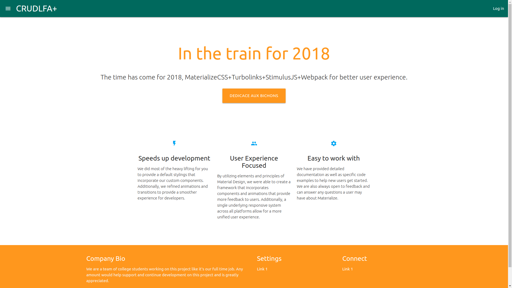
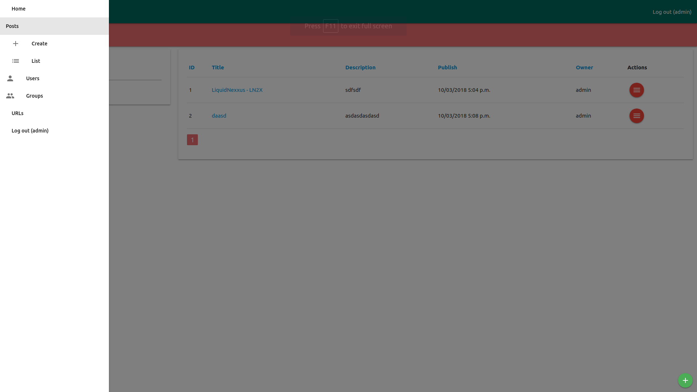
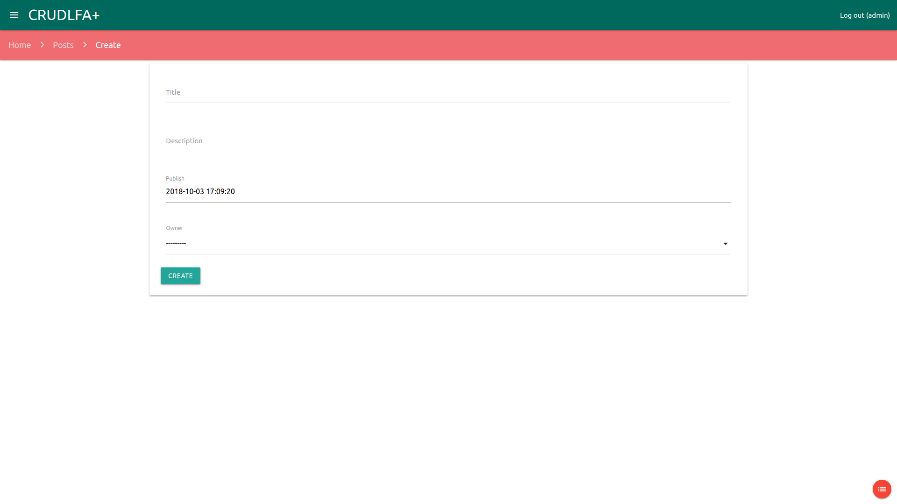
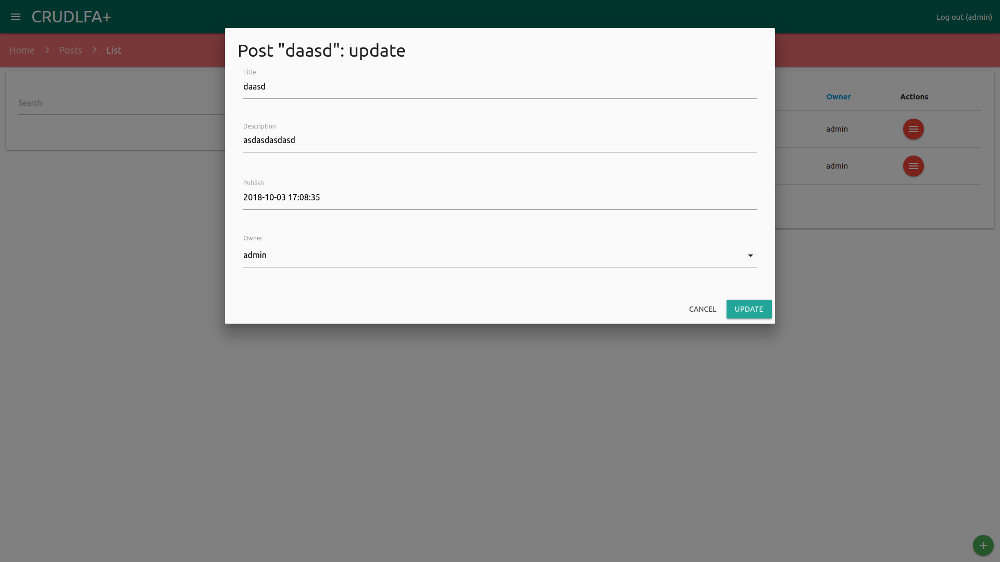
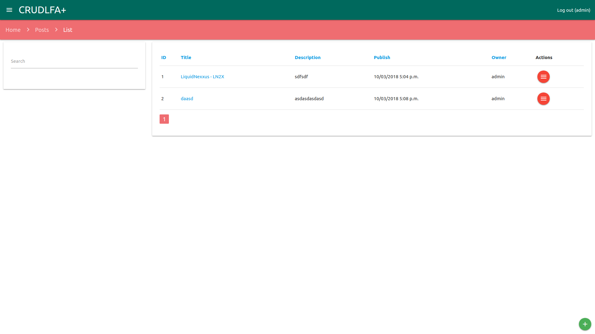

---

@title[CRUDLFA]

## CRUDLFA+

CRUDLFA+ stands for Create Read Update Delete List Form Autocomplete and more.

---

## pip
-	#### @css[byline](@color[#DC143C](pip) is a package manager for Python packages, or modules if you like.)
---

## Virtualenv
-	#### @css[byline](@color[#DC143C](virtualenv) is a tool to create isolated Python environments.)

---
### Django
-	@css[byline](Django is a free and open source web application framework written in Python. A framework is nothing more than a collection of modules that make development easier.)

---

### Installation of Django
	  pip install django

---
### Create Project
	  django-admin startproject mysite

@css[byline](This will create a mysite directory in your current directory, and the structure would like this)

---
### Create application
	  django-admin startapp post

@css[byline](This will create a post application in under the your mysite directory.)
---
#####	Your application structure would like this.

---
- Run Server
	  python manage.py runserver

- You can access your application using the following URL.
	  http://127.0.0.1:8000

---
### @css[crudlfa-headline](Integration of CRUDLFA+)

- You can install CRUDLFA+ by the following ways. |
	- Installing from pip |
		  pip install crudlfap
	- If you are not in a virtualenv, the above will fail if not executed as root, in this case use |
		  pip install --user crudlfap
---

### @css[crudlfa-headline](Integration of CRUDLFA+)
- After installing CRUDLFA+ we need to set two environment variable.
	  export SECRET_KEY="s(8@2hb@+*&ke#n0^634-vkv&7g&^d#ql5_0^ud(74(zqst#0$"
	  export DEBUG=True
	  source ~/.bashrc

- Add the following settings under the settings.py file.
	  from crudlfap.settings import CRUDLFAP_APPS
	  from crudlfap.settings import CRUDLFAP_TEMPLATE_BACKEND
---

### @css[crudlfa-headline](Integration of CRUDLFA+)

- Add the following line after INSTALLED_APPS.
	  INSTALLED_APPS = [
	  	.....
	  	.....
	  ] + CRUDLFAP_APPS
---
### @css[crudlfa-headline](Integration of CRUDLFA+)
- Add the @color[#DC143C](CRUDLFAP_TEMPLATE_BACKEND) line inside TEMPLATES.
	  TEMPLATES = [
	      {
	          'BACKEND': 'django.template.backends.django.DjangoTemplates',
	          'DIRS': [],
	          'APP_DIRS': True,
	          'OPTIONS': {
	              'context_processors': [
	              	.....
	              ],
	          },
	      },
	      CRUDLFAP_TEMPLATE_BACKEND,
	  ]

---
### @css[crudlfa-headline](Integration of CRUDLFA+)
- import the crudlfap from the @color[#DC143C](crudlfap).
	  from crudlfap import crudlfap
- Add the @color[#DC143C](crudlfap.site.urlpattern) line inside main urls.py file.
	  urlpatterns = [
	      path('admin/', admin.site.urls),
	      crudlfap.site.urlpattern,
	  ]
---
### @css[crudlfa-headline](CRUDLFA+ GUI)

---
### Using @color[#DC143C](CRUDLFA+)
-  The post application that we created now we need to register that application inside INSTALLED_APPS like:

	   INSTALLED_APPS = [
	  	.....
	  	'post',
	   ]
---
### Using @color[#DC143C](CRUDLFA+)
-  Now, We need to create a Django Model for the post like:
	  
	   from django.db import models
	   from django.contrib.auth.models import User
	   from django.utils import timezone

	   class Post(models.Model):
	      """A Post model with name, publish and owner fields."""

	      name = models.CharField(max_length=100, verbose_name='title')
	      description = models.TextField(verbose_name='Description')
	      publish = models.DateTimeField(default=timezone.now)
	      owner = models.ForeignKey(User, on_delete=models.CASCADE)

	      def __str__(self):
	          """Return string name."""
	          return self.name

---
### Using @color[#DC143C](CRUDLFA+)
-  Now, We need to create post table using @color[#DC143C](makemigrations) and @color[#DC143C](migrate) commands like
	   python manage.py makemigrations
- after that we need to apply this migration by following command.
	   python manage.py migrate

---
### Using @color[#DC143C](CRUDLFA+)
- Now we need to create a super user by the following command.
	   python manage.py createsuperuser	
- This will ask some information like
	   Username (leave blank to use 'cis'): 
	   Email address: 
	   Password: 
	   Password (again): 
       Superuser created successfully.

---
### Using @color[#DC143C](CRUDLFA+)
- Now we need to create file crudlfap.py inside your post directory and write this piece of code into this file.
	   from crudlfap import crudlfap
	   from .models import Post

	   class PostRouter(crudlfap.Router):
	       fields = '__all__'
	       icon = 'blog'
	       model = Post

	   PostRouter().register()

---
- Now you would be able to see the post application inside your application like following example.

---
- Create Post

---
- Update Post

---
- List Post

---?image=assets/images/gitpitch-audience.jpg
# @color[#DC143C](Thank-You)
